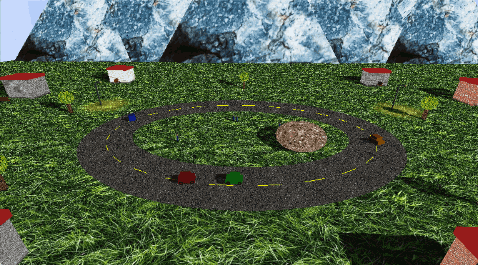
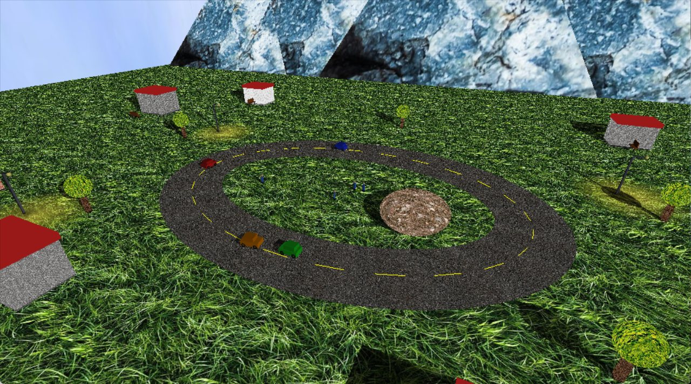
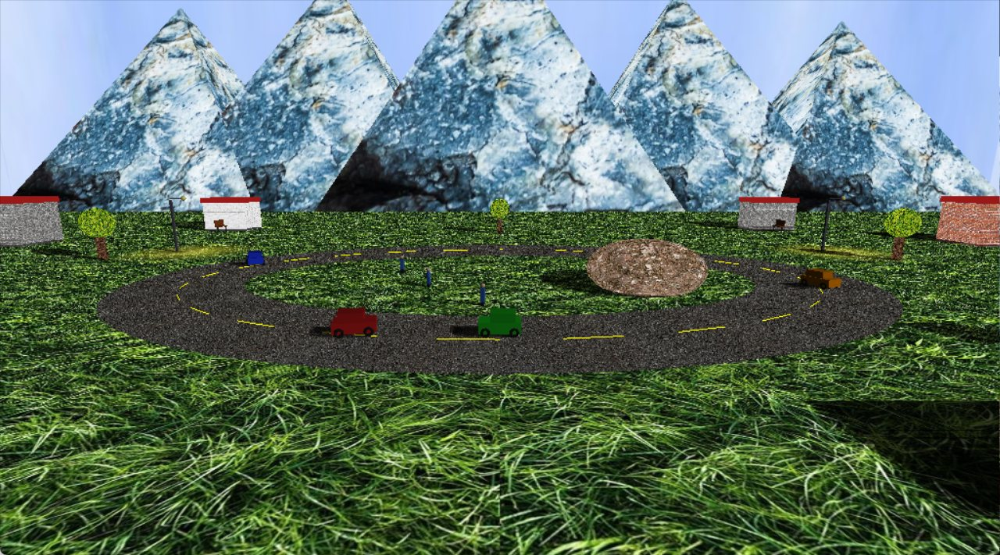

# Town Scene

A small interactive 3D town written in C++ with legacy OpenGL and freeglut. You drive a car around a
ring road while other cars follow the circuit and pedestrians wander in the middle; the camera orbits
freely around the scene.

It was built for a computer graphics course and later cleaned up as a portfolio project.



| Overview | Street level |
|---|---|
|  |  |

## What it shows

- **Drivable car** with acceleration, friction and reversing. It stops on collision with buildings
  (axis-aligned boxes), the other cars, pedestrians and the boulder (circles).
- **Traffic**: three cars driving on an elliptical circuit, each oriented along the ellipse's tangent.
- **Pedestrians** that pick a random direction every few seconds and turn back before reaching the road.
- **Lighting**: a sun plus four street lamps as OpenGL spotlights, with a soft pool of light on the ground.
- **Planar shadows**: every object is flattened onto the ground by a projection matrix built from the sun position.
- **Textures** on the ground, road, buildings, trees, mountains and a sky box that follows the camera.
- **Orbit camera** with rotation, tilt, zoom and panning.

## Controls

| Key | Action |
|---|---|
| Arrow keys | Drive the car (up/down: accelerate/brake, left/right: steer) |
| A / D | Rotate the camera around the scene |
| W / S | Tilt the camera up / down |
| Q / E | Move the camera target forward / back |
| + / − or mouse wheel | Zoom in / out |
| Esc | Quit |

## Building

Requirements: a C++17 compiler, CMake 3.16+, OpenGL and freeglut.

**Windows (Visual Studio).** Download the [freeglut MSVC package](https://www.transmissionzero.co.uk/software/freeglut-devel/),
then point CMake at it:

```bash
cmake -S . -B build -DFREEGLUT_ROOT=C:/libs/freeglut
cmake --build build --config Release
build\Release\town-scene.exe
```

**Linux.**

```bash
sudo apt install build-essential cmake freeglut3-dev
cmake -S . -B build
cmake --build build
./build/town-scene
```

Run the program from the project folder: textures are loaded from `assets/textures/`.

## Project structure

```
src/main.cpp           the whole program: scene data, drawing, simulation and input
assets/textures/       textures (JPEG)
third_party/stb/       stb_image, used to load the textures
docs/                  screenshots for this README
```

## Credits

- [stb_image](https://github.com/nothings/stb) by Sean Barrett (public domain / MIT).
- [freeglut](https://freeglut.sourceforge.net/) for windowing and input (not included in this repository).
